# ClosetAI Architecture

## 1. Purpose

This document is the primary technical architecture reference for ClosetAI. It translates the product direction in `PROJECT_SPEC.md` into system boundaries, service responsibilities, data flow, operational expectations, and long-term engineering constraints.

ClosetAI is an iOS-first AI virtual try-on platform. The MVP supports one focused flow: a user signs in, uploads or captures a personal photo, uploads or selects a clothing image, submits a try-on request, waits for backend generation, then views, compares, saves, deletes, or shares the result.

This document describes responsibilities and contracts, not implementation details. It intentionally keeps clear boundaries between the iOS app, Backend, and Inference Service. The Backend must never depend directly on a specific AI model, and the iOS app must never know which model is running.

## 2. Architectural Goals

- Support the MVP virtual try-on journey without adding wardrobe, marketplace, or stylist scope.
- Keep the iOS app responsive while generation runs asynchronously on backend infrastructure.
- Treat the Backend as the canonical owner of identity, authorization, jobs, entitlements, usage, and persisted results.
- Isolate all model-specific behavior inside the Inference Service.
- Allow CatVTON or any future try-on model to be swapped without changing the iOS app or public API contracts.
- Protect sensitive user images through private storage, short-lived access, encryption, explicit deletion, and strict authorization.
- Support App Store release requirements, including Sign in with Apple, account deletion, privacy controls, and StoreKit 2 entitlement validation.
- Scale API, queue, storage, and GPU-backed inference independently.
- Make failures observable, recoverable, and explainable to users without leaking internal details.
- Maintain clean engineering boundaries suitable for a production system expected to grow to millions of users.

## 3. High-Level System Overview

ClosetAI is composed of three primary application boundaries:

- iOS App: user experience, image selection, local validation guidance, upload orchestration, status display, result viewing, comparison, saving, deletion, sharing, and purchase flows.
- Backend: public API, authentication, authorization, canonical data, asset ownership, job lifecycle, entitlement enforcement, usage ledger, queue orchestration, and result metadata.
- Inference Service: internal AI generation boundary responsible for virtual try-on processing through configurable model adapters.

Supporting systems include PostgreSQL, Redis, Celery workers, AWS S3, observability infrastructure, deployment automation, and StoreKit 2 transaction validation.

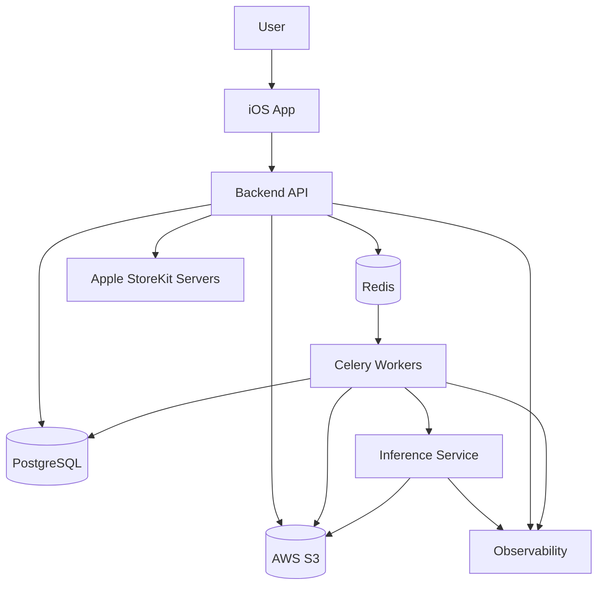

## 4. Core Components

### iOS App

The iOS app owns the user-facing product flow. It should be optimized for clarity, responsiveness, and trust while treating backend state as canonical.

Responsibilities:

- Sign in with Apple flow.
- Photo and clothing image selection through camera and PhotosPicker.
- Lightweight local image quality guidance using Vision Framework where appropriate.
- Secure upload coordination using backend-issued upload instructions.
- Try-on job submission and status polling or subscription.
- Result viewing, comparison, saving, deletion, and native sharing.
- StoreKit 2 purchase and entitlement UX.
- Local persistence for drafts, pending jobs, cached history, and UI continuity.

Non-responsibilities:

- Direct object storage access without backend authorization.
- Server-side entitlement decisions.
- AI model selection.
- AI pipeline configuration.
- Trusting local validation as authoritative.

### Backend API

The Backend API is the public system boundary for the iOS app. It owns product-level orchestration and enforces all security, ownership, entitlement, and lifecycle rules.

Responsibilities:

- Authentication and session validation.
- User profile and account deletion workflows.
- Asset registration and ownership enforcement.
- Pre-signed S3 upload and download coordination.
- Try-on job creation, status, cancellation, and result lookup.
- Entitlement and usage enforcement.
- Standard error responses.
- API versioning and backward compatibility.
- Audit events and product analytics emission.

Non-responsibilities:

- Direct dependence on CatVTON, SAM2, CodeFormer, RealESRGAN, FLUX, or any other specific model.
- Long-running synchronous generation.
- Exposing storage keys, GPU topology, queue internals, or model parameters to clients.

### Worker Layer

Workers execute asynchronous backend tasks that should not run inside request-response API handlers.

Responsibilities:

- Validating uploaded assets after storage.
- Advancing try-on job state transitions.
- Calling the Inference Service through a stable internal contract.
- Handling bounded retries and structured failure codes.
- Persisting result metadata.
- Emitting metrics and logs for every stage.

### Inference Service

The Inference Service owns all model-specific execution behind a stable internal interface.

Responsibilities:

- Accept normalized try-on requests from backend workers.
- Route requests to configured model adapters.
- Run segmentation, try-on generation, restoration, and enhancement stages.
- Store generated artifacts through controlled storage access.
- Return stable result metadata and quality signals.
- Support model rollout, rollback, versioning, and canary evaluation.

Non-responsibilities:

- Public API behavior.
- User authentication.
- StoreKit entitlement decisions.
- Product-level job lifecycle ownership.

## 5. End-to-End Data Flow

The primary data flow begins with user-controlled input assets and ends with a persisted generated result.

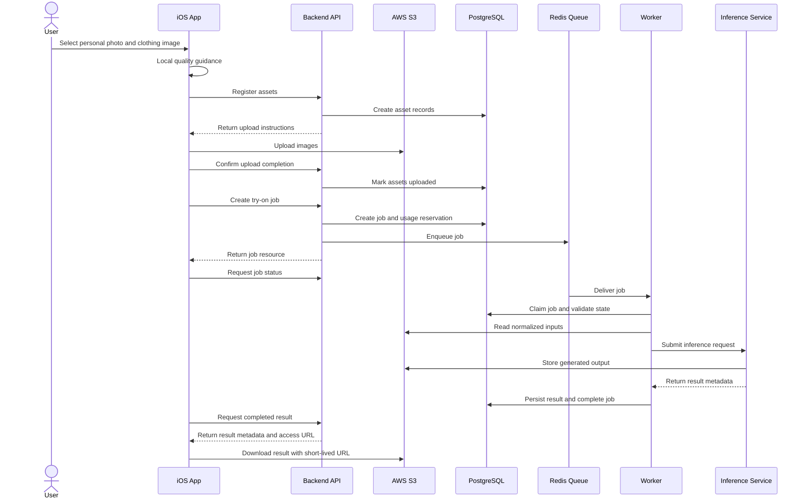

## 6. Request Lifecycle

A try-on request is a product-level workflow, not a single synchronous API call.

1. Asset Registration: The client asks the Backend to register a user photo asset and a clothing image asset.
2. Upload Authorization: The Backend creates asset records and returns short-lived upload instructions.
3. Upload: The iOS app uploads assets to private S3 locations.
4. Upload Confirmation: The client confirms upload completion to the Backend.
5. Validation: The Backend validates ownership, file metadata, and processing eligibility.
6. Entitlement Check: The Backend verifies whether the user can create a generation request.
7. Job Creation: The Backend creates a durable try-on job and records a usage reservation.
8. Queueing: The job is enqueued for asynchronous processing.
9. Worker Claim: A worker claims the job, revalidates state, and prepares inference input references.
10. Inference: The worker calls the Inference Service through the internal inference contract.
11. Result Persistence: The worker stores output metadata, final state, model metadata, and quality signals.
12. Client Retrieval: The iOS app retrieves job status and result access through the Backend.
13. User Action: The user saves, compares, shares, regenerates, or deletes the result.
14. Ledger Finalization: The Backend finalizes usage accounting based on completion, failure, refund, or retry rules.

## 7. iOS Architecture

The iOS architecture should be organized around user workflows and state ownership. SwiftUI renders the interface, Observation manages app state, Swift Concurrency handles asynchronous work, and SwiftData stores local continuity state.

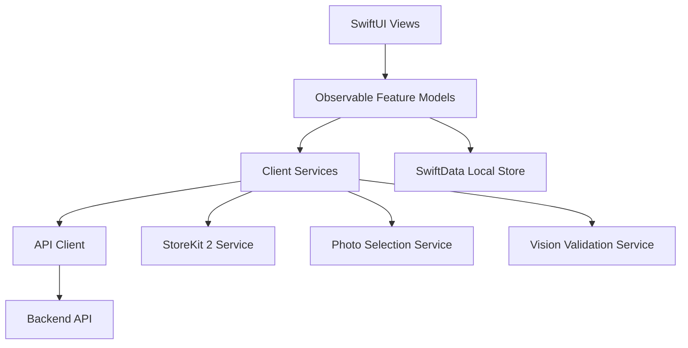

Responsibilities by layer:

- Views: render state, collect user intent, and avoid business logic.
- Observable Feature Models: own screen state, workflow progression, validation state, and user actions.
- Client Services: encapsulate API communication, upload coordination, StoreKit 2, PhotosPicker, camera, sharing, and local validation.
- SwiftData Store: cache drafts, pending uploads, job references, result metadata, and local UI continuity.
- API Client: handle authenticated requests, API versioning, standard error decoding, retries where safe, and request correlation IDs.

State principles:

- Backend state is canonical for jobs, assets, results, entitlements, and account status.
- Local state exists for responsiveness and recovery, not authority.
- The app should recover pending uploads and in-progress jobs after termination or backgrounding.
- The app should never branch behavior based on model names or inference implementation details.

## 8. Backend Architecture

The Backend is a domain-oriented service boundary built around authenticated resources and durable workflows.

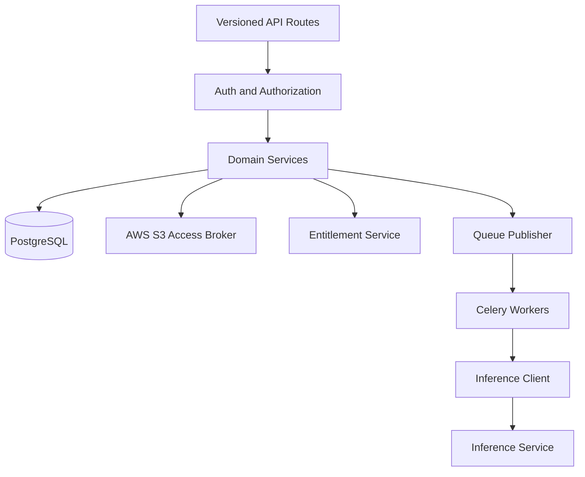

Core Backend domains:

- Users: account identity, deletion, and profile state.
- Auth Identities: Sign in with Apple subject mapping and token verification.
- Assets: source image records, ownership, upload state, validation status, and retention state.
- Try-On Jobs: generation lifecycle, job state, failure codes, and result linkage.
- Results: generated output metadata, visibility, deletion state, and user actions.
- Entitlements: subscription state, credit state, and generation eligibility.
- Usage Ledger: generation attempts, successful completions, failures, refunds, and adjustments.
- Safety Reviews: content checks, validation decisions, and abuse signals.
- Audit Events: security-relevant and compliance-relevant system actions.

Backend principles:

- API handlers should be thin and delegate business rules to domain services.
- Domain services should depend on stable internal contracts, not model-specific behavior.
- Job lifecycle transitions should be explicit and persisted.
- Storage access should be mediated by backend authorization.
- User-visible errors should use the standard error response format.

## 9. Inference Service Architecture

The Inference Service is an internal service boundary dedicated to AI execution. It exposes a stable inference contract to backend workers and hides model-specific behavior behind adapters.

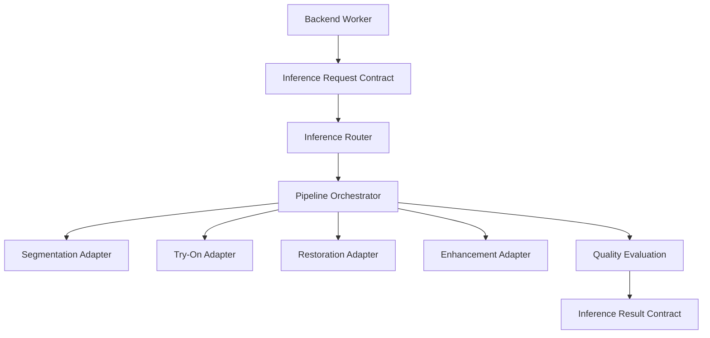

Inference responsibilities:

- Receive normalized asset references, job metadata, safety context, and requested output profile.
- Select an inference pipeline through backend-controlled configuration or rollout policy.
- Execute model adapters behind stable contracts.
- Persist generated artifacts and internal quality metadata.
- Return result references, quality signals, adapter metadata, and structured failure codes.

Model abstraction rules:

- The public API does not expose model names.
- The iOS app does not know which model is running.
- Backend domain services do not import model-specific code or require model-specific parameters.
- Workers call the Inference Service contract, not CatVTON or any future model directly.
- Model changes are handled by Inference Service configuration, adapter rollout, and internal pipeline versioning.
- Inference result metadata may record model family, model version, adapter version, configuration hash, runtime, and quality signals for internal observability and debugging.

## 10. Database Architecture

PostgreSQL is the canonical relational data store. It should model ownership, lifecycle state, entitlements, usage, and auditability explicitly.

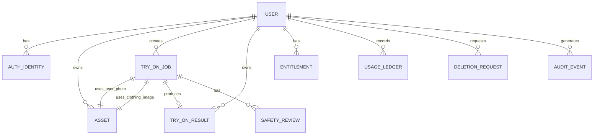

Primary entity responsibilities:

- User: canonical account record and lifecycle status.
- AuthIdentity: external identity provider mapping, initially Sign in with Apple.
- Asset: source image or derived image metadata, ownership, storage reference, validation status, and retention state.
- TryOnJob: durable generation request, state machine state, input asset references, entitlement decision, and failure code.
- TryOnResult: generated output record, quality metadata, source job linkage, and deletion state.
- Entitlement: subscription, credit, or usage-limit state synchronized with StoreKit 2.
- UsageLedger: immutable accounting events for attempts, completions, failures, refunds, and adjustments.
- SafetyReview: validation and content-safety decisions.
- DeletionRequest: account-level or asset-level deletion workflow tracking.
- AuditEvent: security, privacy, and compliance-relevant actions.

Database principles:

- Use opaque server-generated identifiers.
- Use explicit lifecycle states rather than inferred nullable fields.
- Prefer immutable ledger records for billing-sensitive events.
- Preserve created, updated, completed, failed, deleted, and retention timestamps where relevant.
- Keep model metadata attached to results for internal debugging without exposing it to public clients.

## 11. Storage Architecture

AWS S3 stores source assets, normalized inputs, generated outputs, and optional intermediate artifacts.

Storage responsibilities:

- Private object storage for all user photos and generated outputs.
- Environment and ownership-aware object organization.
- Server-side encryption for stored assets.
- Short-lived pre-signed URLs for upload and download.
- Lifecycle policies for temporary and intermediate artifacts.
- Deletion workflows aligned with account deletion and result deletion.

Storage classes:

- Source User Photo: user-provided image used as a try-on input.
- Source Clothing Image: garment image used as a try-on input.
- Normalized Input: processed image prepared for inference.
- Intermediate Artifact: masks, crops, or temporary files used during generation.
- Generated Result: user-visible try-on output.
- Export Artifact: optional share-ready variant if needed in the future.

Access principles:

- S3 objects are private by default.
- The iOS app receives access only through Backend-authorized short-lived URLs.
- Object keys are internal implementation details and must not be treated as authorization.
- Intermediate artifacts should not be retained permanently unless there is a defined product, support, quality, or compliance reason.

## 12. Authentication & Authorization

ClosetAI uses Sign in with Apple for user authentication in the iOS MVP. The Backend validates identity and maintains the canonical account mapping.

Authentication responsibilities:

- Verify Sign in with Apple identity tokens server-side.
- Map Apple subject identifiers to internal user records.
- Support private relay email behavior.
- Issue and validate app session credentials.
- Support account deletion and session revocation.

Authorization responsibilities:

- Enforce user ownership for every asset, job, result, entitlement, ledger entry, and deletion request.
- Ensure pre-signed URLs are issued only for authorized resources.
- Gate generation requests through server-side entitlement checks.
- Prevent users from accessing raw storage paths or other users' generated outputs.
- Record security-relevant authorization failures as audit events where appropriate.

Authorization model:

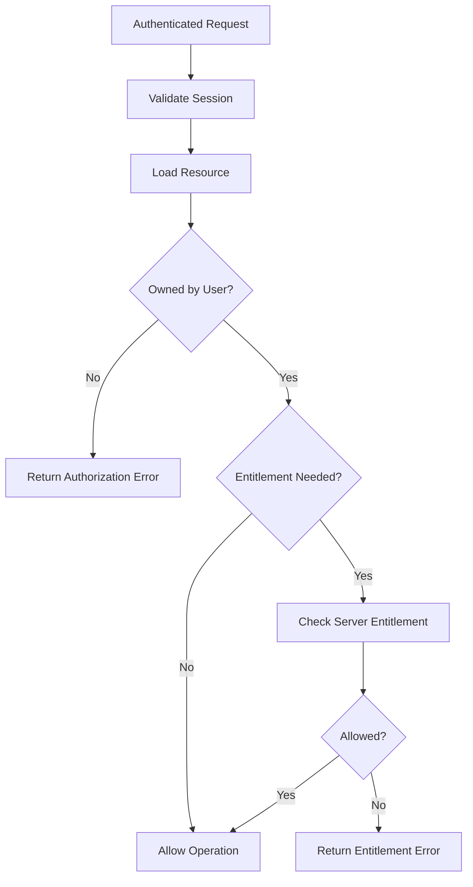

## 13. API Communication

The public API is versioned and resource-oriented. It should expose product concepts, not infrastructure or model internals.

API conventions:

- Version all public endpoints with a major version path, starting with `/v1`.
- Use stable resource paths such as `/v1/assets`, `/v1/try-on-jobs`, `/v1/results`, and `/v1/entitlements`.
- Use opaque server-generated identifiers.
- Use idempotency keys for retryable creation requests.
- Use cursor-based pagination for list endpoints.
- Use ISO 8601 UTC timestamps.
- Treat additive enum values as possible in clients.
- Maintain an API changelog for externally visible changes.

Standard error response:

```json
{
  "error": {
    "code": "TRY_ON_UNSUPPORTED_GARMENT",
    "message": "This clothing image is not supported for virtual try-on.",
    "requestId": "req_01J4Z8K9M2Q7",
    "details": {
      "field": "clothingAssetId",
      "reason": "multiple_garments_detected"
    }
  }
}
```

Error families:

- Authentication errors.
- Authorization errors.
- Validation errors.
- Entitlement errors.
- Rate limit errors.
- Asset upload errors.
- Try-on job lifecycle errors.
- Inference failure errors.
- Storage access errors.
- Internal service errors.

Client communication principles:

- The iOS app should decode standard errors consistently.
- User-safe messages can be displayed when appropriate.
- Request IDs should be included in support and diagnostic flows.
- The API should not expose model names, model parameters, queue internals, GPU topology, or S3 object keys.

## 14. Job Queue Architecture

Redis and Celery coordinate asynchronous job execution. Queueing isolates variable-latency AI work from API request handling.

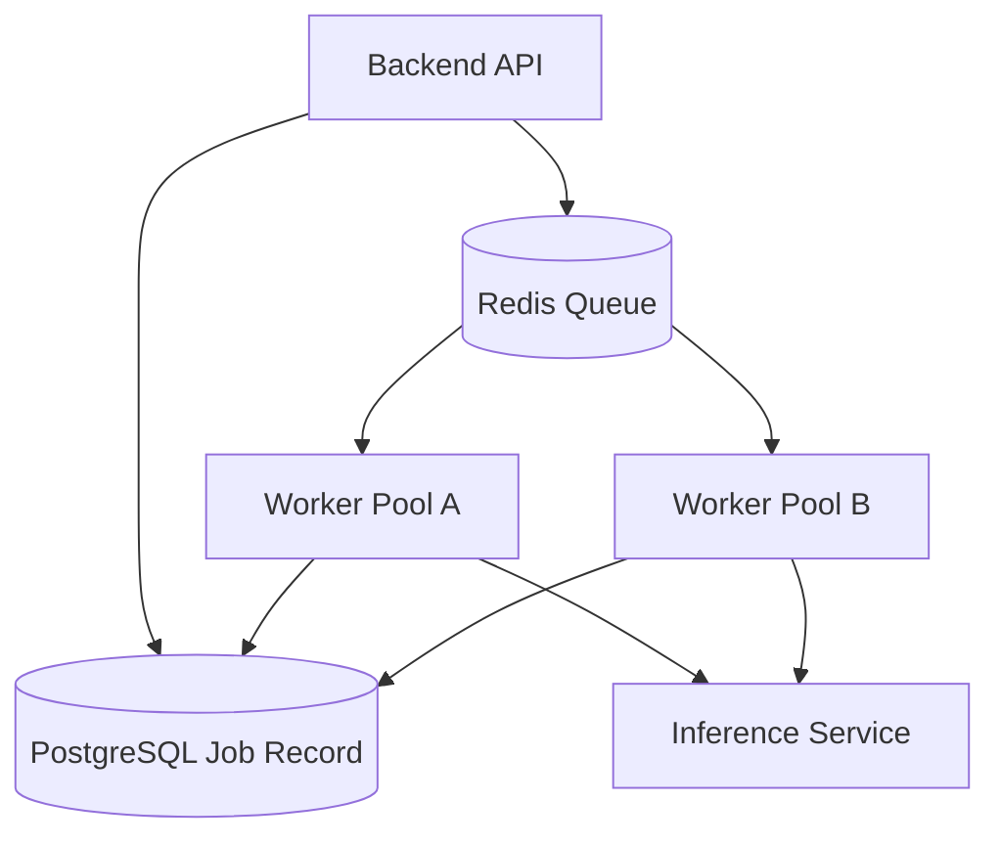

Queue responsibilities:

- Buffer try-on jobs for asynchronous execution.
- Support retries with bounded retry counts.
- Support separate queues for priority, retry, dead-letter, and maintenance work.
- Provide backpressure when inference capacity is constrained.
- Allow worker pools to scale independently from the API service.

Worker responsibilities:

- Claim jobs safely.
- Recheck database state before processing.
- Advance state transitions atomically.
- Call the Inference Service through the internal contract.
- Persist structured failure codes.
- Avoid duplicate billing for retried jobs.

## 15. AI Pipeline

The AI pipeline is owned by the Inference Service. The pipeline is described as responsibilities and stages, not as public API behavior.

Pipeline stages:

1. Input Preparation: load authorized asset references, normalize image format, and prepare inference-ready inputs.
2. Safety and Quality Checks: reject inputs that cannot produce credible or policy-compliant output.
3. Segmentation: isolate person and garment regions through a configured segmentation adapter.
4. Try-On Generation: generate the virtual try-on through a configured try-on adapter.
5. Restoration: improve face or identity-sensitive regions when quality gates allow it.
6. Enhancement: upscale or enhance the result when it improves user-visible quality.
7. Quality Evaluation: compute internal quality signals and detect likely failure modes.
8. Artifact Persistence: store generated outputs and any retained metadata.
9. Result Contract: return stable result references and metadata to the worker.


Model independence requirements:

- The configured try-on adapter may initially use CatVTON.
- The configured segmentation adapter may initially use SAM2.
- The configured restoration adapter may initially use CodeFormer.
- The configured enhancement adapter may initially use RealESRGAN.
- Any adapter can be replaced without changing iOS behavior or public API schemas.
- Pipeline versioning should support canary rollout, shadow evaluation, and rollback.

## 16. State Machines

State machines make asynchronous workflows predictable, observable, and recoverable.

### Asset State

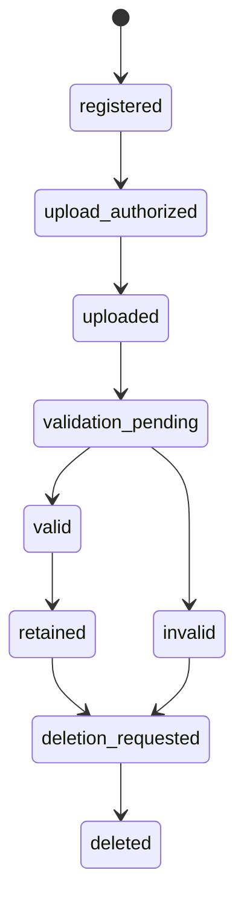

### Try-On Job State

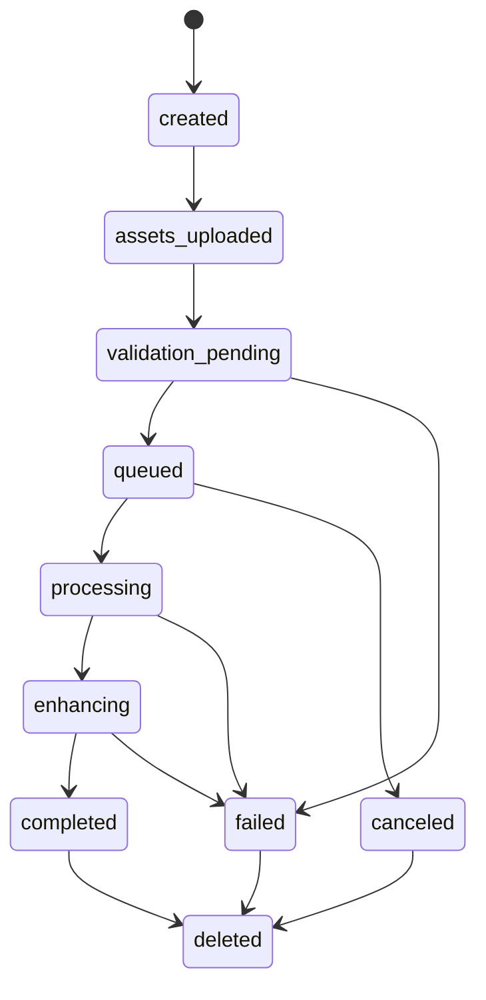

### Result State

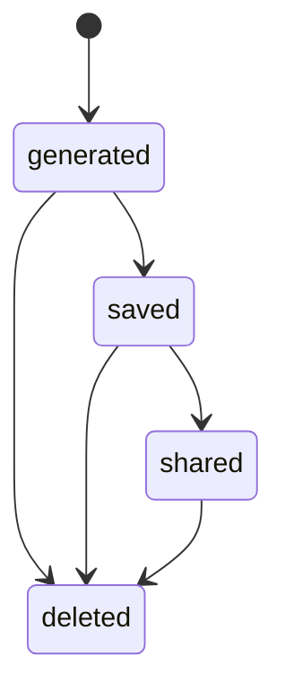

State machine principles:

- Transitions should be explicit and persisted.
- Invalid transitions should be rejected.
- Failure states should include stable failure codes.
- Retried jobs should not create duplicate user charges.
- Deletion should be tracked as a lifecycle state, not only a physical storage operation.

## 17. Scalability Strategy

ClosetAI must scale different workloads independently.

API scaling:

- Horizontally scale stateless API instances.
- Keep request handlers short-lived.
- Move expensive work to queues.
- Use database indexes aligned to ownership, job status, and history queries.

Queue scaling:

- Scale worker pools independently from API servers.
- Separate queues by workload class when needed.
- Apply backpressure when GPU capacity is constrained.
- Use dead-letter queues for repeated failures.

Inference scaling:

- Scale GPU-backed Inference Service capacity separately from backend workers.
- Route requests by model capability, output profile, or rollout cohort.
- Use canary deployments for new model adapters.
- Track cost, latency, throughput, and failure rate by pipeline version.

Storage scaling:

- Use S3 for durable object storage.
- Keep large binary assets out of the database.
- Use lifecycle policies to control retention and cost.
- Use CDN or optimized delivery only when product requirements justify it.

## 18. Caching Strategy

Caching should improve responsiveness without weakening authorization or lifecycle correctness.

Client caching:

- SwiftData caches job references, result metadata, local drafts, and recent history.
- Cached data should reconcile with backend state on app launch and foregrounding.
- Cached result access must not outlive backend authorization.

Backend caching:

- Redis can cache short-lived session, entitlement, rate limit, and job status data.
- PostgreSQL remains canonical for lifecycle and billing-sensitive state.
- Cached entitlements must expire and reconcile with server-side StoreKit validation.

Storage access caching:

- Pre-signed URLs should be short-lived.
- Generated image delivery may use optimized access paths later, but authorization must remain backend-controlled.
- Deleted or revoked assets must not remain accessible through stale long-lived links.

Inference caching:

- The MVP should not assume generated outputs are safely reusable across requests unless the inputs, user, entitlement, and retention policy allow it.
- Any future deduplication must preserve privacy and billing correctness.

## 19. Security Architecture

Security is a core system property because ClosetAI processes sensitive user images.

Security controls:

- Private S3 buckets by default.
- Server-side encryption for stored assets.
- TLS for all network communication.
- Short-lived pre-signed URLs for storage access.
- Server-side authorization for every resource.
- Server-side entitlement enforcement for generation.
- Input validation before expensive processing.
- Rate limiting for upload, job creation, polling, and sharing operations.
- Audit logs for security-relevant actions.
- Account deletion and asset deletion workflows.

Threat boundaries:

- The iOS app is not trusted for entitlement enforcement.
- Object keys are not authorization tokens.
- Queue messages are internal work instructions, not authority.
- Inference outputs must not bypass Backend ownership checks.
- Model metadata and internal quality details should not leak to public clients.

Privacy principles:

- Collect only data needed for the product, safety, billing, and operations.
- Retain intermediate artifacts only with a defined reason.
- Make deletion behavior explicit and enforceable.
- Avoid exposing sensitive metadata in share exports.

## 20. Observability

Observability must cover product behavior, API health, queue health, inference quality, cost, and security signals.

Required telemetry:

- Request logs with request IDs and user-safe correlation IDs.
- API latency, status codes, and error codes.
- Upload success and failure rates.
- Validation failure categories.
- Job queue wait time.
- Worker processing duration.
- Inference duration by pipeline version and adapter version.
- Generation failure categories.
- Result save, delete, compare, share, and regenerate events.
- StoreKit entitlement sync failures.
- S3 read and write failures.
- Cost per completed generation.
- Security and authorization failures.

Observability principles:

- Logs must avoid raw sensitive image data.
- Metrics should be tagged by service, environment, job state, and pipeline version where appropriate.
- User-visible errors should include request IDs for support correlation.
- Model quality regressions should be detectable by versioned inference metrics.

## 21. Deployment Architecture

Deployment should support independently releasable services and safe production rollout.

Deployment units:

- iOS App distributed through the App Store and TestFlight.
- Backend API packaged with Docker.
- Worker services packaged with Docker.
- Inference Service packaged separately from the Backend and deployed to GPU-capable infrastructure.
- PostgreSQL as managed relational storage.
- Redis as managed cache and queue backend where appropriate.
- S3 as managed object storage.

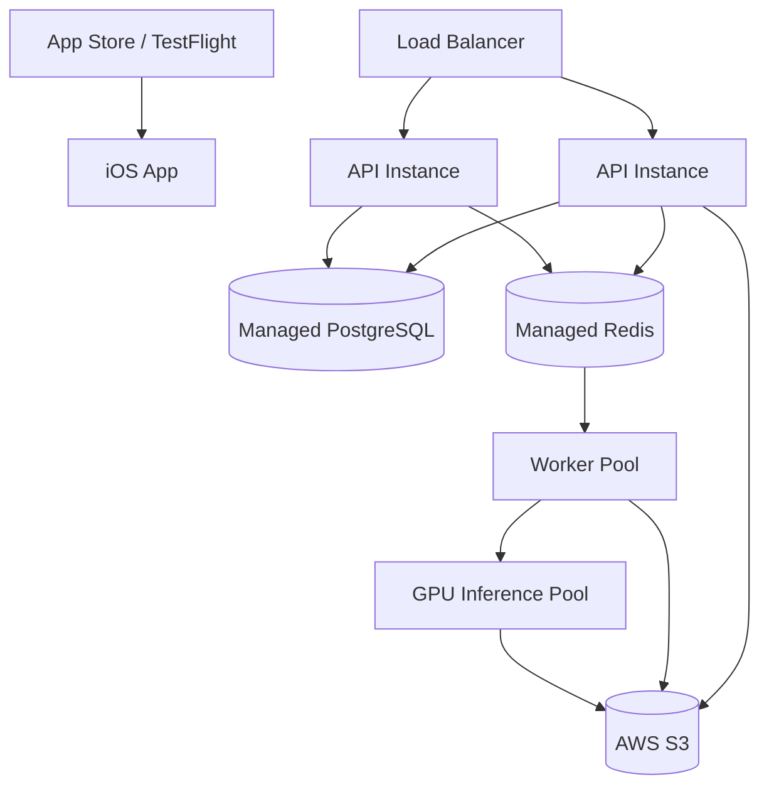

Deployment principles:

- API services should be stateless and horizontally scalable.
- Workers should scale based on queue depth and inference capacity.
- Inference deployments should support canary rollout and rollback.
- Database migrations should be backward-compatible across rolling deploys.
- API changes should preserve `/v1` compatibility unless a new major version is introduced.
- Production, staging, and development environments should be isolated.

## 22. Failure Recovery

ClosetAI should assume partial failure across upload, API, queue, worker, inference, storage, and client layers.

Failure recovery patterns:

- Idempotency keys for retryable creation requests.
- Durable database records before queue publishing.
- Worker revalidation of job state before processing.
- Bounded retries for transient failures.
- Dead-letter queues for repeated failures.
- Structured failure codes for user-safe messaging.
- Usage ledger correction for failed or refunded generations.
- Resumable client state for pending uploads and in-progress jobs.
- Explicit cleanup tasks for orphaned uploads and temporary artifacts.

Failure examples:

- Upload interrupted: client resumes or restarts upload using a new authorized upload flow.
- API succeeds but queue publish fails: recovery job finds created jobs not queued and requeues them.
- Worker crashes during inference: job remains in recoverable state and is retried within bounds.
- Inference fails validation: worker marks job failed with a stable failure code and finalizes usage appropriately.
- Result storage fails: worker retries artifact persistence before marking final failure.
- Account deletion requested during processing: backend cancels or suppresses result visibility and schedules asset deletion.

## 23. Future Evolution

The architecture should support future product phases without forcing MVP concepts into the wrong shape.

Future capabilities supported by current boundaries:

- AI Stylist can consume saved results and preference data through new backend domains.
- Personal Wardrobe can introduce owned garment entities without changing try-on job fundamentals.
- Outfit Recommendations can become a separate recommendation service consuming wardrobe, result, and preference data.
- Shopping Assistant can integrate external product data without making the Backend dependent on retailer-specific flows.
- Fashion Search can introduce embedding and search infrastructure behind a dedicated service boundary.
- Closet Management can be added as a distinct domain rather than overloading MVP asset records.
- New AI models can be introduced as Inference Service adapters without changing the iOS app or public API.

Evolution principles:

- Preserve the MVP try-on path as a stable core workflow.
- Add new domains explicitly rather than expanding generic records until they lose meaning.
- Keep user image privacy and entitlement enforcement centralized.
- Prefer new internal services when scale, ownership, or runtime characteristics differ materially.

## 24. Architectural Decision Records (ADR)

Architectural decisions should be captured as ADRs under `docs/architecture/adr/` when they materially affect system boundaries, data models, security posture, infrastructure, or long-term maintainability.

ADR format:

- Title
- Status: proposed, accepted, superseded, or deprecated
- Context
- Decision
- Consequences
- Alternatives considered
- Date
- Owners

Initial ADR candidates:

- Use Sign in with Apple as the MVP authentication provider.
- Use FastAPI as the public Backend API framework.
- Use PostgreSQL as the canonical relational store.
- Use S3 as private object storage for source and generated images.
- Use Redis and Celery for asynchronous job orchestration.
- Introduce an Inference Service boundary between Backend workers and AI models.
- Keep AI model names out of public API contracts.
- Use StoreKit 2 with server-side entitlement validation.
- Use explicit lifecycle state machines for assets, try-on jobs, and results.
- Use `/v1` URL path versioning for public API contracts.

ADR principles:

- Decisions should be written when the team still remembers the tradeoffs.
- ADRs should explain why a decision was made, not only what was chosen.
- Superseded decisions should remain in history and point to the replacement ADR.
- The architecture document should summarize current state; ADRs should preserve decision history.
