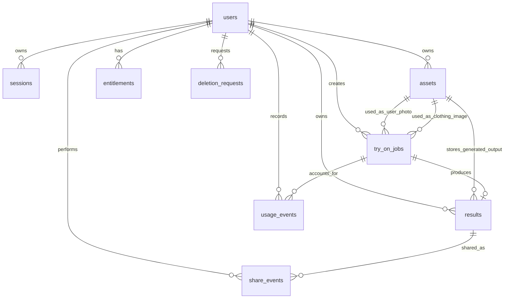
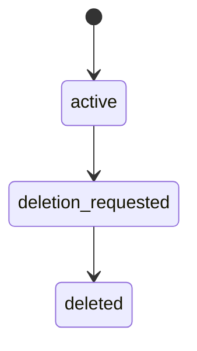
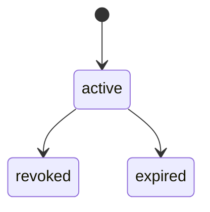
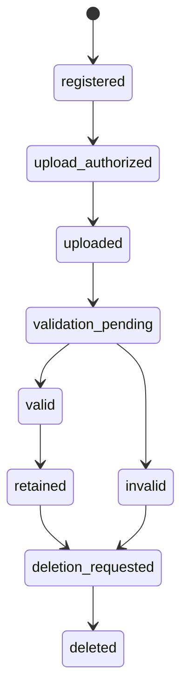
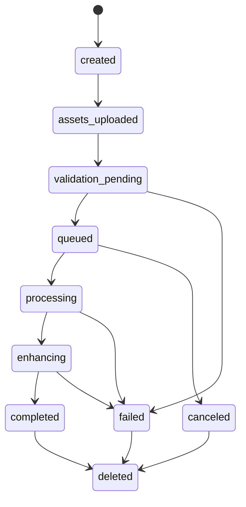
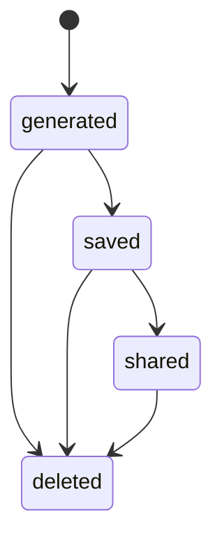
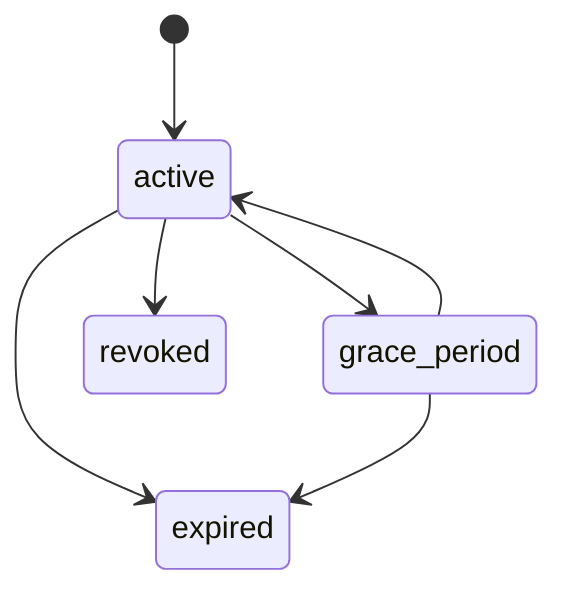
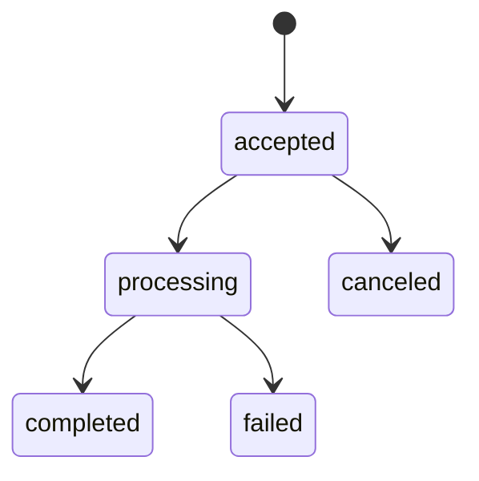

# ClosetAI Database Architecture

## 1. Purpose

This document defines the persistence architecture for ClosetAI. It describes how PostgreSQL and Redis support the MVP virtual try-on flow defined in `PROJECT_SPEC.md`, `ARCHITECTURE.md`, and `API_SPEC.md`.

The database design is responsible for durable product state: users, sessions, assets, try-on jobs, results, entitlements, usage events, share events, and deletion requests. It does not define SQL, ORM models, migrations, or implementation code.

## 2. Database Philosophy

PostgreSQL is the primary database and source of truth for all durable business state. Redis is used only for ephemeral coordination such as rate limits, short-lived cache entries, queue mechanics, locks, and transient job hints.

Persistence principles:

- Model product concepts explicitly rather than hiding lifecycle in generic records.
- Use durable state for ownership, authorization, billing, lifecycle, and deletion decisions.
- Use immutable events for billing-sensitive and audit-sensitive history.
- Store storage references as internal opaque references, never public storage provider details.
- Never store AI model state in PostgreSQL.
- Never require the public API or database schema to know which AI model generated a result.
- Keep inference implementation metadata out of product contracts. If operational metadata is needed, keep it internal and non-authoritative.
- Use UTC for every timestamp.
- Use soft deletion for user-visible resources where lifecycle, recovery, privacy, billing, or auditability require it.

## 3. PostgreSQL Overview

PostgreSQL stores canonical relational state for the Backend API and workers.

Primary responsibilities:

- Account lifecycle and authenticated sessions.
- Asset ownership, upload state, validation state, and deletion lifecycle.
- Try-on job lifecycle and result linkage.
- Generated result lifecycle and sharing state.
- Entitlement state synchronized from StoreKit 2.
- Usage ledger events for generation accounting.
- Share event tracking.
- Account and asset deletion workflows.

Identifier strategy:

ClosetAI uses ULIDs for primary keys across all PostgreSQL tables.

Rationale:

- ULIDs are globally unique without central coordination.
- ULIDs are lexicographically sortable by creation time, which improves operational debugging and time-ordered pagination patterns.
- ULIDs are opaque enough for public API use and do not expose database sequence volume.
- ULIDs work well across distributed API, worker, and future service boundaries.

All public IDs should use resource prefixes at the API layer, such as `usr_`, `ast_`, `job_`, and `res_`. The database stores the canonical ULID value and may expose prefixed identifiers through API serialization.

## 4. Entity Relationship Diagram (Mermaid)

Logical relationship notes:

- A try-on job references two input assets: one `user_photo` and one `clothing_image`.
- A result references one generated result asset.
- A user owns every asset, job, result, entitlement, usage event, share event, and deletion request.
- Usage events are ledger records and should be append-only.
- Share events record product behavior and do not grant public access.

## 5. Core Entities

Core entities:

- `users`: canonical account records.
- `sessions`: authenticated API session state.
- `assets`: user-owned image metadata and storage reference state.
- `try_on_jobs`: asynchronous virtual try-on lifecycle records.
- `results`: generated try-on result records.
- `entitlements`: server-side generation access state.
- `usage_events`: immutable usage ledger events.
- `share_events`: result sharing telemetry and lifecycle events.
- `deletion_requests`: account, asset, and result deletion workflow records.

Entity boundary rules:

- `assets` describes source and generated image metadata, not public storage details.
- `try_on_jobs` describes product lifecycle, not queue or model internals.
- `results` describes generated output lifecycle, not inference implementation.
- `usage_events` is the source of truth for generation accounting history.
- `entitlements` is the current server-side access state derived from StoreKit and usage policy.

## 6. Table Specifications

### users

Purpose: Stores the canonical ClosetAI account record.

| Column | Type | Constraints |
| --- | --- | --- |
| `id` | ULID | Primary key. |
| `apple_subject` | Text | Unique when present. Required for Sign in with Apple accounts. |
| `email` | Text | Nullable. May contain Apple private relay email. |
| `display_name` | Text | Nullable. User-editable profile name. |
| `account_state` | Enum | Required. One of `active`, `deletion_requested`, `deleted`. |
| `created_at` | Timestamp UTC | Required. |
| `updated_at` | Timestamp UTC | Required. |
| `deletion_requested_at` | Timestamp UTC | Nullable. |
| `deleted_at` | Timestamp UTC | Nullable. |

Relationships:

- One user has many sessions.
- One user owns many assets.
- One user creates many try-on jobs.
- One user owns many results.
- One user has many entitlements over time.
- One user has many usage events, share events, and deletion requests.

Indexes:

- Primary key on `id`.
- Unique index on `apple_subject`.
- Index on `account_state` for deletion and compliance workflows.
- Index on `created_at` for operational analysis.

Lifecycle:

- `active` when the account can use the product.
- `deletion_requested` after the user requests deletion.
- `deleted` after the deletion workflow completes.

Retention:

- Active accounts are retained while the user maintains the account.
- Deleted accounts retain only the minimum records required for legal, billing, fraud, or operational obligations.
- Personal fields should be anonymized or cleared when deletion completes unless retention is legally required.

### sessions

Purpose: Stores authenticated session records for API access and revocation.

| Column | Type | Constraints |
| --- | --- | --- |
| `id` | ULID | Primary key. |
| `user_id` | ULID | Required foreign key to `users.id`. |
| `session_state` | Enum | Required. One of `active`, `revoked`, `expired`. |
| `token_hash` | Text | Required. Unique. Stores a hash, never the raw access token. |
| `refresh_token_hash` | Text | Nullable. Unique when present. Stores a hash, never the raw refresh token. |
| `device_label` | Text | Nullable. Non-authoritative client/device descriptor. |
| `created_at` | Timestamp UTC | Required. |
| `updated_at` | Timestamp UTC | Required. |
| `expires_at` | Timestamp UTC | Required. |
| `revoked_at` | Timestamp UTC | Nullable. |

Relationships:

- Many sessions belong to one user.

Indexes:

- Primary key on `id`.
- Index on `user_id`.
- Unique index on `token_hash`.
- Unique index on `refresh_token_hash` where present.
- Index on `expires_at` for cleanup.
- Composite index on `user_id` and `session_state`.

Lifecycle:

- `active` until expiration, revocation, or account deletion.
- `revoked` when the user signs out or security invalidation occurs.
- `expired` after `expires_at` passes and cleanup marks state.

Retention:

- Active sessions are retained until expiration or revocation.
- Revoked and expired sessions are retained for a short security audit window, then purged or minimized.

### assets

Purpose: Stores metadata and lifecycle state for user-owned images. This includes user photos, clothing images, and generated result assets.

| Column | Type | Constraints |
| --- | --- | --- |
| `id` | ULID | Primary key. |
| `user_id` | ULID | Required foreign key to `users.id`. |
| `asset_kind` | Enum | Required. One of `user_photo`, `clothing_image`, `generated_result`. |
| `asset_state` | Enum | Required. One of `registered`, `upload_authorized`, `uploaded`, `validation_pending`, `valid`, `invalid`, `retained`, `deletion_requested`, `deleted`. |
| `content_type` | Text | Required for uploaded assets. |
| `file_size_bytes` | Integer | Required for uploaded assets. Must be non-negative. |
| `width` | Integer | Nullable until known. Must be positive when present. |
| `height` | Integer | Nullable until known. Must be positive when present. |
| `checksum_sha256` | Text | Nullable. Used for upload validation and deduplication decisions. |
| `storage_ref` | Text | Nullable internal opaque storage reference. Must not expose provider details through the API. |
| `validation_code` | Text | Nullable stable validation failure or warning code. |
| `created_at` | Timestamp UTC | Required. |
| `updated_at` | Timestamp UTC | Required. |
| `uploaded_at` | Timestamp UTC | Nullable. |
| `validated_at` | Timestamp UTC | Nullable. |
| `deletion_requested_at` | Timestamp UTC | Nullable. |
| `deleted_at` | Timestamp UTC | Nullable. |

Relationships:

- Many assets belong to one user.
- Try-on jobs reference one `user_photo` asset and one `clothing_image` asset.
- Results reference one `generated_result` asset.

Indexes:

- Primary key on `id`.
- Composite index on `user_id` and `asset_state`.
- Composite index on `user_id`, `asset_kind`, and `created_at`.
- Index on `deletion_requested_at` for deletion workers.
- Optional index on `checksum_sha256` for internal validation and deduplication workflows.

Lifecycle:

- Starts as `registered` or `upload_authorized`.
- Moves to `uploaded` after upload confirmation.
- Moves through `validation_pending` to `valid` or `invalid`.
- User-visible retained assets may use `retained`.
- Deletion moves through `deletion_requested` to `deleted`.

Retention:

- Source images are retained only as needed for user history, regeneration support, support, or policy-defined quality workflows.
- Invalid or abandoned uploads should expire quickly.
- Deleted assets should remove or anonymize personal metadata after the deletion workflow completes.
- Intermediate storage artifacts are not represented as durable public assets unless product requirements require it.

### try_on_jobs

Purpose: Stores durable asynchronous virtual try-on request lifecycle.

| Column | Type | Constraints |
| --- | --- | --- |
| `id` | ULID | Primary key. |
| `user_id` | ULID | Required foreign key to `users.id`. |
| `user_photo_asset_id` | ULID | Required foreign key to `assets.id`. Must reference a user-owned `user_photo`. |
| `clothing_asset_id` | ULID | Required foreign key to `assets.id`. Must reference a user-owned `clothing_image`. |
| `job_state` | Enum | Required. One of `created`, `assets_uploaded`, `validation_pending`, `queued`, `processing`, `enhancing`, `completed`, `failed`, `canceled`, `deleted`. |
| `output_profile` | Text | Required product-level output profile, such as `standard`. |
| `result_id` | ULID | Nullable foreign key to `results.id`. Present after completion. |
| `failure_code` | Text | Nullable stable product-level failure code. |
| `failure_message` | Text | Nullable user-safe failure message. |
| `idempotency_key_hash` | Text | Nullable. Used for retry-safe job creation. |
| `created_at` | Timestamp UTC | Required. |
| `updated_at` | Timestamp UTC | Required. |
| `queued_at` | Timestamp UTC | Nullable. |
| `processing_started_at` | Timestamp UTC | Nullable. |
| `completed_at` | Timestamp UTC | Nullable. |
| `failed_at` | Timestamp UTC | Nullable. |
| `canceled_at` | Timestamp UTC | Nullable. |
| `deleted_at` | Timestamp UTC | Nullable. |

Relationships:

- Many jobs belong to one user.
- A job uses one user photo asset and one clothing image asset.
- A job may produce one result.
- A job may have many usage events.

Indexes:

- Primary key on `id`.
- Composite index on `user_id` and `created_at` for user history.
- Composite index on `job_state` and `queued_at` for worker discovery and recovery.
- Composite index on `user_id`, `job_state`, and `created_at` for API lists.
- Unique index on `user_id` and `idempotency_key_hash` where present.
- Index on `result_id` where present.

Lifecycle:

- Created by API after entitlement and ownership checks.
- Moves through validation and queue states.
- Terminal user-visible states are `completed`, `failed`, `canceled`, or `deleted`.
- Workers must perform explicit state transitions and reject invalid transitions.

Retention:

- Completed and failed job records are retained for user history, billing support, abuse investigation, and operational analysis.
- Deleted jobs should be hidden from normal user views and minimized according to deletion policy.
- Job records must not store AI model state.

### results

Purpose: Stores user-visible generated try-on result records.

| Column | Type | Constraints |
| --- | --- | --- |
| `id` | ULID | Primary key. |
| `user_id` | ULID | Required foreign key to `users.id`. |
| `try_on_job_id` | ULID | Required foreign key to `try_on_jobs.id`. Unique. |
| `result_asset_id` | ULID | Required foreign key to `assets.id`. Must reference a `generated_result` asset. |
| `result_state` | Enum | Required. One of `generated`, `saved`, `shared`, `deleted`. |
| `quality_summary` | JSON Object | Nullable internal product-level quality summary. Must not contain model state. |
| `created_at` | Timestamp UTC | Required. |
| `updated_at` | Timestamp UTC | Required. |
| `saved_at` | Timestamp UTC | Nullable. |
| `shared_at` | Timestamp UTC | Nullable. |
| `deletion_requested_at` | Timestamp UTC | Nullable. |
| `deleted_at` | Timestamp UTC | Nullable. |

Relationships:

- Many results belong to one user.
- One result belongs to one try-on job.
- One result references one generated result asset.
- One result may have many share events.

Indexes:

- Primary key on `id`.
- Unique index on `try_on_job_id`.
- Index on `result_asset_id`.
- Composite index on `user_id`, `result_state`, and `created_at` for user history.
- Index on `deletion_requested_at` for deletion workers.

Lifecycle:

- `generated` when inference completes and output is available.
- `saved` when the user saves it to history.
- `shared` when share activity is recorded.
- `deleted` when deletion completes or visibility is removed.

Retention:

- Saved results are retained while the user account is active unless the user deletes them.
- Generated but unsaved results may have a shorter retention period if product policy allows.
- Deleted results should no longer produce download URLs and should trigger associated asset deletion.

### entitlements

Purpose: Stores server-side generation access state derived from StoreKit 2, free tier policy, credits, or future paid plans.

| Column | Type | Constraints |
| --- | --- | --- |
| `id` | ULID | Primary key. |
| `user_id` | ULID | Required foreign key to `users.id`. |
| `plan` | Enum | Required. One of `free`, `subscription`, `credits`. |
| `entitlement_state` | Enum | Required. One of `active`, `expired`, `grace_period`, `revoked`. |
| `remaining_generations` | Integer | Nullable. Must be non-negative when present. |
| `storekit_original_transaction_id` | Text | Nullable. Unique when present. |
| `storekit_product_id` | Text | Nullable. |
| `renews_at` | Timestamp UTC | Nullable. |
| `created_at` | Timestamp UTC | Required. |
| `updated_at` | Timestamp UTC | Required. |
| `expires_at` | Timestamp UTC | Nullable. |
| `revoked_at` | Timestamp UTC | Nullable. |

Relationships:

- Many entitlement records may belong to one user over time.
- Usage events consume or adjust entitlement-derived generation access.

Indexes:

- Primary key on `id`.
- Composite index on `user_id` and `entitlement_state`.
- Unique index on `storekit_original_transaction_id` where present.
- Index on `renews_at` for renewal reconciliation.
- Index on `expires_at` for expiration processing.

Lifecycle:

- `active` when generation is allowed by this entitlement.
- `grace_period` during payment or platform grace windows.
- `expired` when access ends normally.
- `revoked` after refund, cancellation, fraud, or administrative action.

Retention:

- Entitlement records are retained for billing support, fraud analysis, and compliance.
- StoreKit identifiers should be retained only as long as required for reconciliation and support.

### usage_events

Purpose: Stores immutable generation usage ledger events.

| Column | Type | Constraints |
| --- | --- | --- |
| `id` | ULID | Primary key. |
| `user_id` | ULID | Required foreign key to `users.id`. |
| `try_on_job_id` | ULID | Nullable foreign key to `try_on_jobs.id`. Required for generation-related events. |
| `entitlement_id` | ULID | Nullable foreign key to `entitlements.id`. |
| `event_kind` | Enum | Required. One of `generation_reserved`, `generation_completed`, `generation_failed`, `generation_refunded`, `credit_adjusted`. |
| `quantity` | Integer | Required. Positive or negative depending on event semantics. |
| `reason_code` | Text | Nullable stable reason code. |
| `metadata` | JSON Object | Nullable product-level metadata. Must not contain sensitive image data or model state. |
| `created_at` | Timestamp UTC | Required. |

Relationships:

- Many usage events belong to one user.
- Many usage events may reference one try-on job.
- Many usage events may reference one entitlement.

Indexes:

- Primary key on `id`.
- Composite index on `user_id` and `created_at` for history.
- Composite index on `try_on_job_id` and `event_kind` for job accounting.
- Index on `entitlement_id`.
- Index on `event_kind` for reporting.

Lifecycle:

- Append-only after creation.
- Corrections are represented by additional events, not mutation.

Retention:

- Retained for billing support, entitlement reconciliation, abuse analysis, and financial audit requirements.
- Should be minimized or dissociated from deleted users where permitted by policy and law.

### share_events

Purpose: Records user-initiated sharing behavior for generated results.

| Column | Type | Constraints |
| --- | --- | --- |
| `id` | ULID | Primary key. |
| `user_id` | ULID | Required foreign key to `users.id`. |
| `result_id` | ULID | Required foreign key to `results.id`. |
| `share_surface` | Text | Required. Example: `ios_share_sheet`. |
| `created_at` | Timestamp UTC | Required. |

Relationships:

- Many share events belong to one user.
- Many share events reference one result.

Indexes:

- Primary key on `id`.
- Composite index on `user_id` and `created_at`.
- Index on `result_id`.
- Index on `share_surface` for product analytics.

Lifecycle:

- Append-only event after creation.
- Does not grant public access and does not contain shared recipient data.

Retention:

- Retained for product analytics and abuse investigation according to analytics retention policy.
- Should be anonymized or deleted during account deletion unless retained for legal or security reasons.

### deletion_requests

Purpose: Tracks asynchronous deletion workflows for accounts, assets, and results.

| Column | Type | Constraints |
| --- | --- | --- |
| `id` | ULID | Primary key. |
| `user_id` | ULID | Required foreign key to `users.id`. |
| `target_type` | Enum | Required. One of `user`, `asset`, `result`. |
| `target_id` | ULID | Required. References the logical deletion target. |
| `request_state` | Enum | Required. One of `accepted`, `processing`, `completed`, `failed`, `canceled`. |
| `reason_code` | Text | Nullable. |
| `idempotency_key_hash` | Text | Nullable. |
| `created_at` | Timestamp UTC | Required. |
| `updated_at` | Timestamp UTC | Required. |
| `processing_started_at` | Timestamp UTC | Nullable. |
| `completed_at` | Timestamp UTC | Nullable. |
| `failed_at` | Timestamp UTC | Nullable. |

Relationships:

- Many deletion requests belong to one user.
- A deletion request targets one user, asset, or result.

Indexes:

- Primary key on `id`.
- Composite index on `request_state` and `created_at` for deletion workers.
- Composite index on `user_id` and `created_at`.
- Composite index on `target_type` and `target_id`.
- Unique index on `user_id` and `idempotency_key_hash` where present.

Lifecycle:

- `accepted` when the API accepts the deletion request.
- `processing` while background cleanup is running.
- `completed` after durable records and storage artifacts reach the required deletion or minimization state.
- `failed` when manual or automated recovery is required.
- `canceled` only when policy permits cancellation before processing.

Retention:

- Retained as privacy/compliance workflow evidence.
- Personal target metadata should be minimized after completion where possible.

## 7. Relationships

Ownership relationships:

- `users.id` is the ownership root for user-scoped data.
- Every user-visible resource must carry `user_id` directly for authorization and query efficiency.
- Foreign key ownership should be validated so jobs cannot reference another user's assets.

Workflow relationships:

- `try_on_jobs.user_photo_asset_id` references an asset with `asset_kind = user_photo`.
- `try_on_jobs.clothing_asset_id` references an asset with `asset_kind = clothing_image`.
- `try_on_jobs.result_id` references the generated result after completion.
- `results.result_asset_id` references an asset with `asset_kind = generated_result`.
- `usage_events.try_on_job_id` links billing events to generation workflow.
- `share_events.result_id` links share behavior to generated outputs.

Deletion relationships:

- Account deletion creates a `deletion_requests` row with `target_type = user`.
- Result deletion creates a deletion request and transitions the result and generated asset lifecycle.
- Asset deletion creates a deletion request and removes or minimizes associated storage artifacts.

## 8. Constraints

Core constraints:

- Primary keys are ULIDs.
- Foreign keys enforce referential integrity for canonical relationships.
- Required lifecycle fields must be non-null.
- Timestamps are UTC.
- File sizes are non-negative.
- Width and height are positive when present.
- Usage event quantities must match event semantics.
- Idempotency key hashes are unique within the relevant user and operation scope.

Product constraints:

- A try-on job must reference exactly one user photo asset and one clothing image asset.
- A try-on job must not complete without a result.
- A result must reference exactly one generated result asset.
- A result must belong to the same user as its try-on job.
- A job's input assets must belong to the same user as the job.
- Deleted assets and results cannot be used for new try-on jobs or download URL creation.

Boundary constraints:

- PostgreSQL must not store raw image binaries.
- PostgreSQL must not store raw access tokens or refresh tokens.
- PostgreSQL must not store public S3 URLs as durable state.
- PostgreSQL must not store AI model state, model weights, or model execution internals.
- API serialization must not expose `storage_ref` or provider-specific storage metadata.

## 9. Index Strategy

Indexing should support the primary product paths without prematurely optimizing speculative future features.

Primary query patterns:

- Authenticate session by token hash.
- Load current user by Sign in with Apple subject.
- List assets by user, kind, state, and creation time.
- List try-on jobs by user and creation time.
- Poll active try-on job by ID and user.
- Discover queued or stuck jobs by state and timestamp.
- List results by user, state, and creation time.
- Load current entitlement by user and active state.
- Reconcile StoreKit transactions by original transaction ID.
- Summarize usage by user and time range.
- Process deletion requests by state and creation time.

Index principles:

- Prefer composite indexes that match ownership plus sort/filter patterns.
- Keep hot polling queries narrow and indexed.
- Use partial indexes for active states where useful.
- Avoid indexing large JSON metadata fields unless a real query pattern requires it.
- Review index usage with production telemetry before adding broad analytics indexes.

## 10. Lifecycle States

### User State

### Session State

### Asset State

### Try-On Job State

### Result State

### Entitlement State

### Deletion Request State

## 11. Soft Delete Strategy

Soft deletion is required where deletion is asynchronous, user-visible history exists, billing records must remain consistent, or storage cleanup may lag database state.

Soft-deleted entities:

- `users`
- `assets`
- `try_on_jobs`
- `results`
- `deletion_requests`

Append-only entities:

- `usage_events`
- `share_events`

Session cleanup:

- `sessions` use lifecycle state and expiration rather than user-visible soft deletion.

Soft delete behavior:

- Set lifecycle state to deletion-related state before background cleanup.
- Set `deleted_at` only when deletion or minimization requirements complete.
- Exclude deleted records from normal API list responses.
- Prevent deleted records from generating download URLs or new try-on jobs.
- Preserve minimal records required for billing, fraud, security, or compliance.

## 12. Audit Fields

Standard audit fields:

- `created_at`
- `updated_at`
- `deleted_at` where soft deletion applies
- Lifecycle-specific timestamps such as `uploaded_at`, `validated_at`, `queued_at`, `completed_at`, `failed_at`, `revoked_at`, and `expires_at`

Audit field rules:

- All timestamps use UTC.
- `created_at` is immutable.
- `updated_at` changes whenever mutable state changes.
- Terminal timestamps are set once when entering terminal lifecycle states.
- Append-only events should not update after creation except for exceptional administrative correction metadata if policy permits it.

Additional audit considerations:

- This document does not define a separate audit log table because the requested MVP schema is limited to the listed tables.
- Security and compliance audit events may be added later as a dedicated table or event stream.
- Usage events and deletion requests provide MVP auditability for billing and privacy workflows.

## 13. Transactions

Database transactions should protect state transitions and billing-sensitive writes.

Transactional boundaries:

- User creation and initial entitlement creation.
- Session creation and token hash persistence.
- Asset registration and upload authorization metadata.
- Try-on job creation, entitlement reservation, and usage event creation.
- Worker job claim and state transition.
- Job completion, result creation, generated asset association, and usage completion event.
- Job failure and usage failure or refund event.
- Result deletion request creation and result state transition.
- Account deletion request creation and user state transition.

Transaction principles:

- Use short transactions around durable state changes.
- Do not hold database transactions while calling object storage, StoreKit, Redis, or the Inference Service.
- Use idempotency records or unique constraints to make client retries safe.
- Record usage ledger effects atomically with entitlement-affecting transitions.

## 14. Concurrency Strategy

Concurrency must handle retries, polling, background workers, and app restarts without duplicate charges or invalid states.

Strategies:

- Use optimistic concurrency for user-facing updates where conflicts are rare.
- Use row-level locking or equivalent claim semantics for worker job processing.
- Use explicit lifecycle state checks before every transition.
- Use idempotency key hashes for retryable create operations.
- Use unique constraints to prevent multiple results for one try-on job.
- Use append-only usage events to avoid destructive billing history updates.
- Use bounded retries and failure states for worker recovery.

Concurrency examples:

- Two client retries create the same try-on job: idempotency returns the same job rather than creating two jobs.
- Two workers see the same queued job: only one can claim and transition it to `processing`.
- A user deletes a result while a download URL is requested: the lifecycle state check prevents new access after deletion begins.
- StoreKit sync and generation creation race: entitlement checks and usage reservation occur inside transactional boundaries.

## 15. Redis Usage

Redis is ephemeral infrastructure, not the source of truth.

Allowed Redis usage:

- Celery broker or queue coordination.
- Short-lived rate limit counters.
- Short-lived session or entitlement cache entries.
- Distributed locks with strict expiration.
- Job status hints for faster polling responses.
- Idempotency response cache when backed by durable PostgreSQL records.

Redis rules:

- Redis data must be reconstructable from PostgreSQL or external authoritative services.
- Redis must not be the only record of entitlement, usage, job completion, or deletion state.
- Redis must not store raw image data.
- Redis must not store AI model state.
- Redis keys should have TTLs unless there is a specific operational reason not to.

## 16. Background Jobs

Background jobs operate on PostgreSQL state and object storage through explicit lifecycle transitions.

Job categories:

- Asset validation jobs.
- Try-on processing jobs.
- Job recovery and requeue jobs.
- StoreKit entitlement reconciliation jobs.
- Usage ledger reconciliation jobs.
- Deletion cleanup jobs.
- Abandoned upload cleanup jobs.
- Expired session cleanup jobs.

Background job principles:

- Jobs should be idempotent.
- Jobs should re-read PostgreSQL state before taking action.
- Jobs should avoid assuming queue delivery means authority to act.
- Jobs should write structured failure codes to durable records.
- Jobs should not store AI model state in PostgreSQL.
- Jobs should clean up temporary storage artifacts according to retention policy.

## 17. Data Retention Policy

Retention is driven by user trust, privacy, product utility, billing support, and operational safety.

Retention categories:

- Account data: retained while the account is active; minimized after deletion.
- Sessions: retained only for active use and short security audit windows.
- Source assets: retained while needed for user history, active jobs, or explicitly saved workflows.
- Generated results: retained while visible to the user unless deleted or expired by policy.
- Unsaved generated results: may have shorter retention than saved results.
- Invalid or abandoned uploads: expire quickly.
- Usage events: retained for billing, support, fraud, and compliance requirements.
- Share events: retained for analytics and abuse investigation within analytics retention limits.
- Deletion requests: retained as compliance evidence with minimized personal data.

Deletion principles:

- User deletion should cascade through visibility and storage cleanup workflows.
- Storage deletion may be asynchronous but must be tracked.
- API responses should stop exposing deleted resources as soon as deletion begins where appropriate.
- Retention windows must be documented before production launch.

## 18. Backup & Recovery

PostgreSQL backup and recovery must support production operation at scale.

Backup requirements:

- Automated backups for PostgreSQL.
- Point-in-time recovery capability.
- Regular restore drills in a non-production environment.
- Backup encryption.
- Backup access restricted to authorized operators.
- Backup retention aligned with privacy and compliance obligations.

Recovery objectives:

- Define recovery point objective before public launch.
- Define recovery time objective before public launch.
- Validate that restored databases preserve referential integrity and lifecycle states.
- Coordinate database recovery with object storage recovery to avoid dangling generated result records.

Redis recovery:

- Redis loss should degrade performance or delay jobs, not corrupt canonical product state.
- Queue recovery should reconcile with PostgreSQL job states.
- Rate limit counters and short-lived caches can be rebuilt.

## 19. Migration Strategy

Schema migrations must support rolling production deployments.

Migration principles:

- Prefer backward-compatible migrations.
- Add nullable columns before requiring them.
- Backfill data in controlled batches.
- Deploy code that can read old and new shapes during transition windows.
- Add constraints only after data is backfilled and validated.
- Avoid long blocking migrations on large tables.
- Version enum changes carefully because clients must tolerate additive states.
- Keep migration rollback plans explicit.

Operational rules:

- Migrations should be reviewed as architecture changes when they affect ownership, billing, lifecycle, or deletion semantics.
- Database migrations should not introduce AI model coupling.
- Storage provider details should remain internal even if storage metadata changes.
- Migration status should be observable in deployment workflows.

## 20. Future Expansion

The MVP schema is intentionally focused on virtual try-on. Future product areas should add explicit domains rather than overloading MVP tables.

Future domains:

- Personal wardrobe: owned garments, wardrobe items, user annotations, and closet lifecycle.
- AI stylist: style preferences, recommendations, feedback, and generated advice history.
- Outfit recommendations: outfit entities, outfit item joins, recommendation events, and ranking feedback.
- Shopping assistant: product references, retailer metadata, wishlists, and comparison history.
- Fashion search: embeddings, search indexes, similarity metadata, and query history.
- Advanced safety: safety review tables, moderation queues, and appeal workflows.
- Audit logging: dedicated audit event table or event stream for security and compliance.

Expansion principles:

- Keep `assets` as image asset metadata, not a general wardrobe item table.
- Keep `try_on_jobs` as virtual try-on workflow state, not a generic AI task table unless the product intentionally introduces a cross-domain job system.
- Keep `usage_events` as immutable accounting history.
- Add new tables when new concepts have distinct lifecycle, ownership, or retention needs.
- Preserve public API independence from inference implementation and storage provider details.

git add docs/DATABASE.md
git commit -m "docs: add system DATABASE" 
git push origin main         
